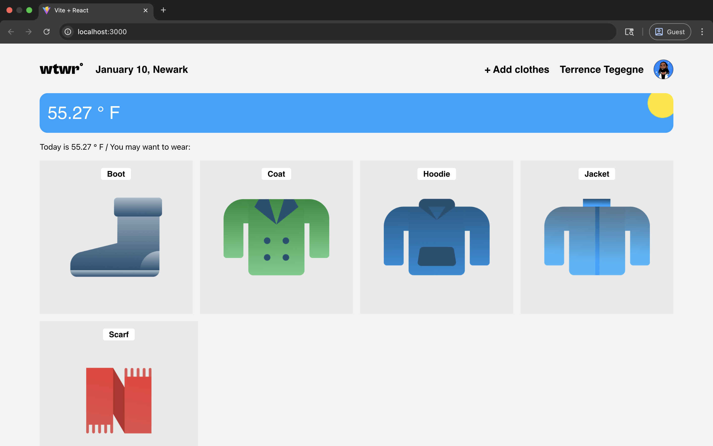

# WTWR (What to Wear)

## Description

A React-based weather application that provides clothing recommendations based on real-time, location-based weather conditions. The app fetches data from the OpenWeather API and filters a clothing collection to suggest the most appropriate outfit for the current temperature.

## Features

- **Dynamic Weather Integration:** Real-time temperature and location fetching.
- **Smart Filtering:** Clothing cards automatically update based on "Hot", "Warm", or "Cold" weather types.
- **Interactive UI:** Modals for adding new garments and previewing clothing details.
- **Responsive Design:** Optimized for various screen sizes.

## Technologies and Techniques

- **React:** Built using functional components and hooks (`useState`, `useEffect`, `useContext`).
- **Vite:** Utilized as the build tool for fast development and HMR (Hot Module Replacement).
- **API Integration:** Asynchronous programming using `fetch` and `.then()` for data retrieval.
- **State Management:** Lifting state up to the `App` component to manage data flow between siblings.
- **CSS Flexbox & Grid:** Used for complex layouts and responsive positioning.

## Project Preview

## Getting Started

1. Clone the repository.
2. Install dependencies: `npm install`
3. Run the development server: `npm run dev`

Currently, two official plugins are available:

- [@vitejs/plugin-react](https://github.com/vitejs/vite-plugin-react/blob/main/packages/plugin-react/README.md) uses [Babel](https://babeljs.io/) for Fast Refresh

- [@vitejs/plugin-react-swc](https://github.com/vitejs/vite-plugin-react-swc) uses [SWC](https://swc.rs/) for Fast Refresh
